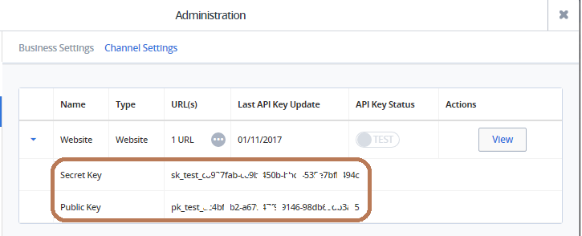

=============
 Checkout.com
=============

* A streamlined payment solution

* Checkout.com’s end-to-end payment technology eliminates intermediaries, while data-rich insights track performance and drive approvals.

* Checkout.com offers two browser-based payment solutions that are suitable for non-PCI compliant merchants, Frames and Checkout.js.

Setting Up a Test Merchant Account
==================================

* You have to create Sandbox account in checkout.com as a sandbox user.

* To obtain the publicKey, kindly log in to the dashboard.

* Go to settings (gear icon of the top right corner), from there you should go to channel settings.

* You should find the keys at this point.

Checkout.js
============

Create Card Token
=====================

The Checkout.js solution will allow to create a card token, and then charge the customer from the server using the generated card token. 

The steps to do this are detailed here:
https://docs.checkout.com/getting-started/checkout-js/charge-via-card-token

Charge with card token API call: 
https://docs.checkout.com/reference/merchant-api-reference/charges/charge-with-card-token 
 
The card token obtained in the cardTokenised event is a single-use token and no charge will be created until you do a charge with card token from the server's backend using merchant API.
Also, note that the real value you want to charge customers needs to originate from the backend and not from the configuration of the JS. 
The value inside the JS is only used for display purposes inside the lightbox.

Here is a sample code you can use to build on for the frontend configuration of Checkout.js :

Code::

	<form class="payment-form" method="POST" action="https://merchant.com/successUrl">
    
    
	</form>
	

And here's a link to the https://docs.checkout.com/reference/checkout-js-reference/configuration-options reference if you wish to customise it further.

Charge with Card Token
======================
 
We Use the card token obtained in the cardTokenised event to make a charge with card token from the odoo server.

* Create checkout charge

Code::

		headers = {'content-type': 'application/json',
		   'Authorization': 'sk_test_55aedccc-7f53-4ccc-b0a6-d943decc3c31'}
		   
		post_url = 'https://sandbox.checkout.com/api2/v2/charges/token'
		
		charge_params = {
		  "autoCapTime": "0",
		  "autoCapture": "Y",
		  "chargeMode": 1,
		  "email": "testuser@email.com",
		  "customerName": "Test User",
		  "description": "charge description",
		  "value": "4298",
		  "currency": "GBP",
		  "trackId": "TRK12345",
		  "cardToken": "card_tok_CB9C10E3-24CC-4A82-B50A-4DEFDCB15580"
		}

		response = requests.post(post_url, data=json.dumps(charge_params), headers=headers)
		
The Card Token received in the cardTokenised event, should be passed to odoo server and do the POST request from odoo server.

Once the Charge with Card Token request has been sent, Checkout.com will return the charge response to the merchant backend server.