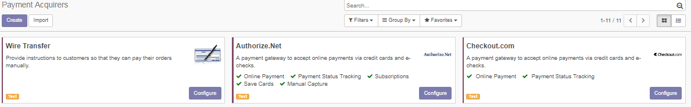

=============
Configuration
=============

To install this module, just you need to install following module: payment_checkout

After install the module 

* Go to Website Admin > Configuration > Settings :

* Add your API Access Key :

.. image:: ../images/check_config.PNG

* Configuration :

Test environment

Once the payment method ready, make it visible in the payment interface and activate the Production mode.

Shop
====

* Choose checkout.com

.. image:: ../images/choose_checkout.PNG

* Test card validity

**Enter Card Details**

If Invalid Card Details Checkout error message until the card will be valid and the button checkout now will be appear.
 
* Card Valid

Once the customer completes and submits his payment details, if the card tokenisation is successful the Checkout.js payment lightbox will appear as follows:

Transaction
===========

* Transaction Invalid

If an error occurred in charging the card, check the status, responseMessage in the response for information regarding the cause of the error

* Transaction Valid

The transaction has been approved by the Issuer and the amount is held on the customer’s card.

* Transaction Sandbox : Transaction Details

* Transaction Odoo : Transaction Details :

